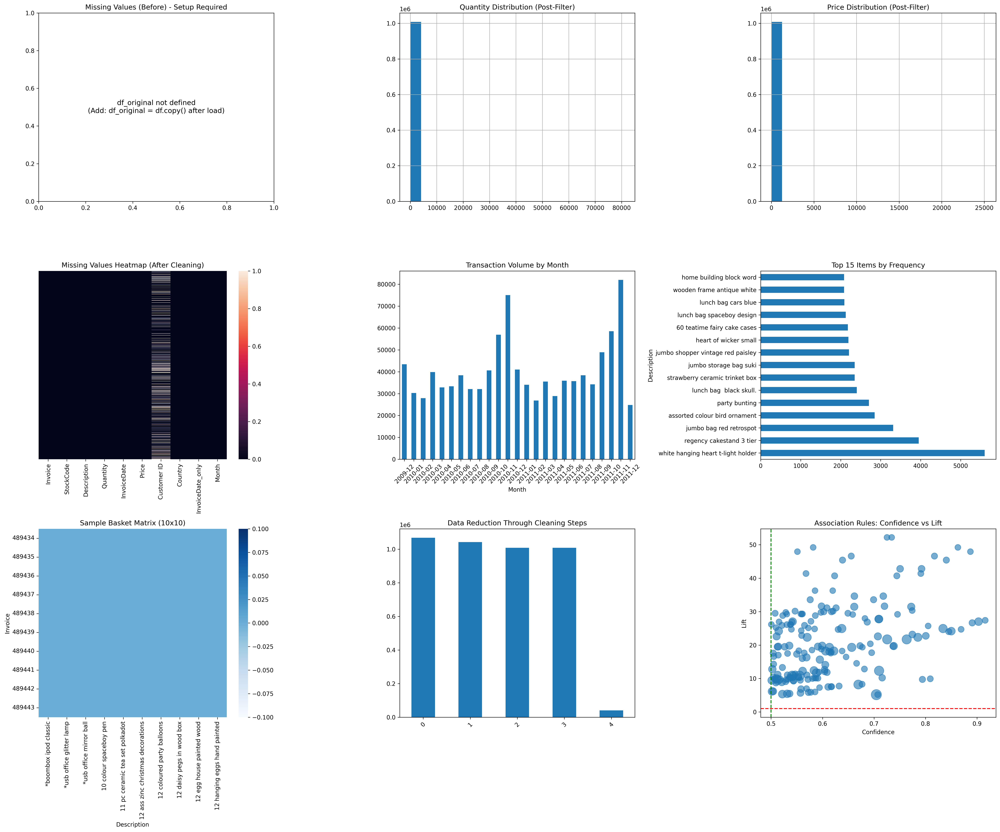

# Online Retail Data Mining Project

This project focuses on performing comprehensive **Data Cleaning, Preprocessing, and Exploratory Data Analysis (EDA)** on the UCI Online Retail dataset. The goal is to prepare the raw transactional data for future data mining tasks such as customer segmentation (RFM analysis), association rule mining, or demand forecasting.

## 📊 Dataset Overview
The dataset contains all transactions occurring between 01/12/2010 and 09/12/2011 for a UK-based, non-store online retail. The company mainly sells unique all-occasion gifts. Many customers of the company are wholesalers.

### Key Features:
* **InvoiceNo**: Transaction identifier.
* **StockCode**: Product item code.
* **Description**: Product name.
* **Quantity**: Quantities of each product per transaction.
* **InvoiceDate**: The day and time when each transaction was generated.
* **UnitPrice**: Product price per unit in sterling.
* **CustomerID**: Unique customer identifier.
* **Country**: The name of the country where each customer resides.

## 📈 Visualizing the Data
Below is the dashboard showing the results of the data preprocessing and initial exploration:




## 🛠️ Data Cleaning & Preprocessing
The following steps were implemented in the pipeline:
1.  **Handling Missing Values**: Identification and treatment of null values (specifically in `CustomerID` and `Description`).
2.  **Removing Duplicates**: Cleaning the dataset of redundant entries.
3.  **Noise Reduction**: Removing negative quantities (returns/cancellations) and zero-priced items to focus on successful sales.
4.  **Feature Engineering**: 
    * Calculation of `TotalPrice` ($Quantity \times UnitPrice$).
    * Extraction of Date-time features (Year, Month, Day, Hour).
5.  **Outlier Removal**: Using the Interquartile Range (IQR) method to handle extreme values in `Quantity` and `UnitPrice`.

## 🚀 Getting Started

### Prerequisites
To run this notebook, you will need:
* Python 3.x
* Pandas
* NumPy
* Matplotlib
* Seaborn
* Openpyxl (for reading Excel files)

### Installation
1. Clone the repository:
   ```bash
   git clone https://github.com/Basmala-ElKady/OnlineRetail-DataMining.git

2. Install dependencies:
   ```bash
   pip install pandas numpy matplotlib seaborn openpyxl


## Authors
- [Basmala ElKady](https://github.com/Basmala-ElKady)
- [Menna Hossny](https://github.com/Mennatullah122)
- [Hoda Mahmoud](https://github.com/HodaMahmoud-2005)
- [Jana Hegazy](https://github.com/janahegazy)
- [Hany Ziad](https://github.com/hanyzead123)
